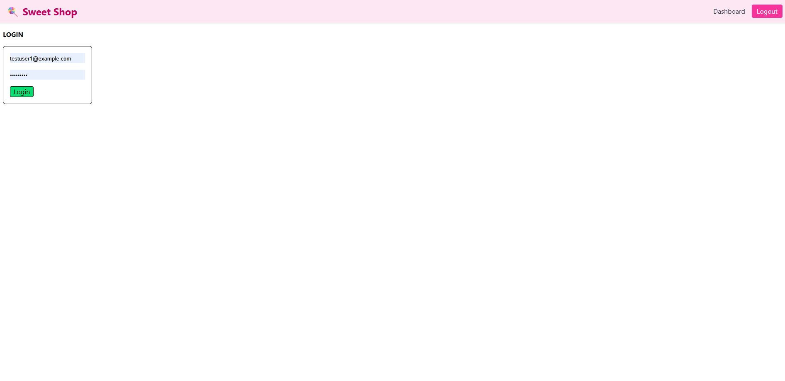
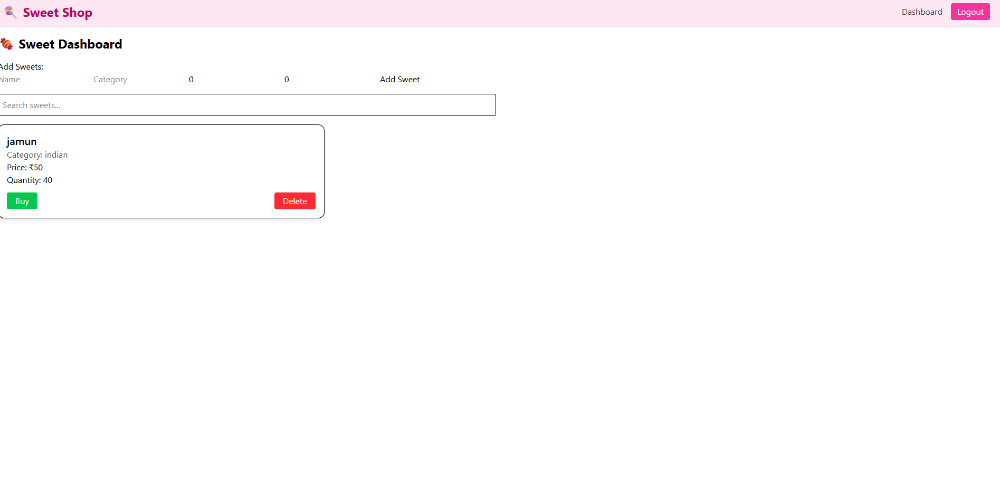

#  Sweet Shop Management System

The **Sweet Shop Management System** is a full-stack web application built to manage the operations of a sweet shop — including user registration, login, inventory management, sweet purchasing, and restocking.  
It demonstrates **Test-Driven Development (TDD)**, RESTful API design, secure user authentication, database management, and modern frontend integration.

    This project was designed as a TDD Kata to practice end-to-end development with both backend and frontend technologies, along with responsible use of AI assistance.

---

## Tech Stack

### **Backend**
- Node.js + Express.js (TypeScript)
- MongoDB + Mongoose
- JWT Authentication
- Jest + Supertest for TDD

### **Frontend**
- React (TypeScript)
- Axios + React Router DOM
- Tailwind CSS (UI styling)

--- 


## 🧪 Test-Driven Development (TDD)

Every backend feature was implemented following the **Red-Green-Refactor** process.

**Test Suites Covered:**
- `app.test.ts` → Base API route check
- `auth.test.ts` → Register + Login user tests
- `sweet.test.ts` → Protected CRUD route tests for sweets

Run tests using:
```
cd backend
npm test
```
---
## My Work
* Initialized the project
* Did app, auth part
* seek the help from GPT for refactor and testing part

---
## My AI Usage
* In start of project to get an overview asked some basic need for this project
* Blindly copied design part fro frontend
* Test cases which are learned from GPT and copied
* Some Unknown packages like jest and some TypeScript are learned and get by GPT with some prompts.

**AI Tools Used**

* ChatGPT (GPT-5) — for understanding the problem, refactoring suggestions, Jest test design and frontend UI.


_here I learned the testing(TDD) part which I don't know and for the first time as react and node developer I used ts(TypeScript)_

---
## ScreenShots
_Login page_


_Dashboard_



BY:
Prajwal V Naik
Master of Computer Applications (MCA), MIT - Manipal
Email: prajwalv346contact@gmail.com
College-mail: prajwal1.mitmpl2024@learner.manipal.edu
GitHub: github.com/Prajwal-V-Naik